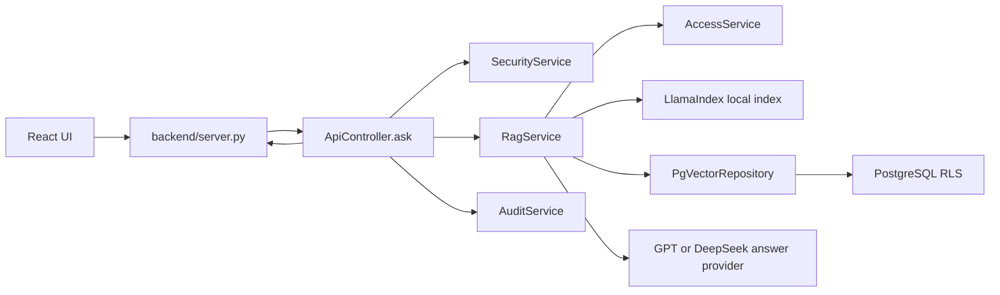
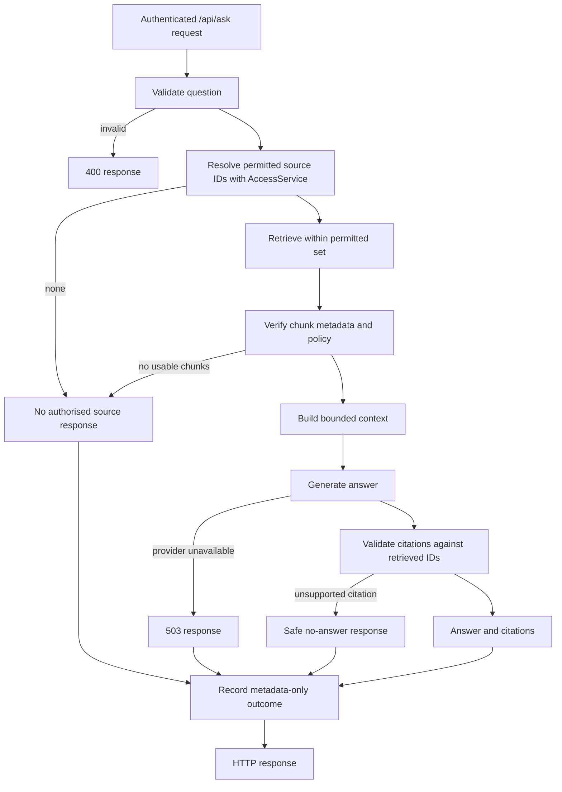

# Optional LangGraph architecture for PeopleVault

## Decision

Add **LangGraph as an optional orchestration layer** for `/api/ask`. Keep the
existing direct RAG path as the baseline. Use the existing LlamaIndex local
retriever, pgvector repository, access policy, embedding model, and answer
providers behind the graph. LangChain model integrations may be adopted later
if they solve a specific provider problem; a LangChain agent is unnecessary for
this controlled HR question-answering flow.

LangGraph is the useful distinction here: it expresses deterministic steps and
conditional transitions explicitly. LangChain agents are higher-level model/tool
loops built on LangGraph. See the [LangGraph overview](https://docs.langchain.com/oss/python/langgraph/overview)
and [LangChain overview](https://docs.langchain.com/oss/python/langchain/overview).

## Current system



The controller authenticates through the HTTP adapter, validates the question,
calls `RagService.retrieve`, calls `RagService.answer`, and records a
metadata-only audit event. `RagService.retrieve` computes the allowed source
set before retrieval. The pgvector path additionally passes those IDs into the
SQL query, uses transaction-local RLS identity, and rechecks returned rows.
The local path builds an index from permitted documents only.

## Proposed query workflow



The diagram describes the target design. Citation validation and context
budgeting are proposed additions; the current `RagService.answer` does not
validate model-generated citations or impose a context budget.

### Boundary rules

1. The HTTP adapter resolves identity from the server-side session. A client
   request never supplies its effective role or allowed document IDs.
2. Policy is evaluated before vector ranking. `PgVectorRepository.search`
   receives only authorised parent IDs; PostgreSQL RLS remains an independent
   database boundary. The local index contains only permitted chunks.
3. Every retrieval result, including neighbour chunks, is checked against
   source metadata and `AccessService.can_read` before entering model context.
4. Branch decisions about access and error handling are deterministic Python
   code. The model may draft an answer only from verified context; it cannot
   choose retrieval scope, call a raw search tool, or alter the audit outcome.
5. The response can cite only IDs in the verified context. An empty authorised
   result produces the fixed no-source response without calling the model.
6. The graph runs per request without a persistent checkpointer. Its transient
   state includes the question and HR text, so persistence, debug traces, and
   third-party observability need a separate privacy design before activation.
   Audit events keep metadata only, as they do today.

### State contract

| Field | Owner | Lifetime |
| --- | --- | --- |
| `identity` | HTTP/session adapter | One invocation; never model supplied |
| `question` | validation node | One invocation; no audit payload |
| `allowed_source_ids` | policy node | One invocation; authoritative scope for retrieval |
| `verified_chunks` | retrieval/verification nodes | One invocation; only source for model context |
| `answer`, `citation_ids`, `outcome` | generation/validation nodes | Returned to controller |

Use a typed state with minimal fields. Keep database connections, LLM clients,
and policy service instances outside state through dependency injection. Do
not place API keys or a complete document corpus in state.

## Proposed module boundaries

```text
backend/
  controllers/api_controller.py       selects direct or graph query workflow
  workflows/
    secure_rag_graph.py               StateGraph nodes, edges, and routing
    state.py                          typed per-request state and outcomes
  services/
    access_service.py                 unchanged policy authority
    rag_service.py                    retrieval and generation primitives
    security_service.py               question validation
    audit_service.py                  one metadata-only terminal event
    llm_service.py                    provider-neutral answer interface
  repositories/
    pgvector_repository.py            scoped SQL search and RLS
```

`ApiController.ask` should retain the HTTP response contract. A workflow
interface such as `run(identity, question) -> QueryResult` lets the direct and
LangGraph paths be selected through configuration. The controller should record
exactly one audit event for each completed query outcome, including provider
failure. The graph should not emit HTTP responses or write audit records from
individual nodes.

## Implementation sequence

1. Add a typed `QueryResult` and a workflow interface without changing the
   `/api/ask` response fields.
2. Extract authorised retrieval and answer generation behind reusable service
   methods. Preserve both LlamaIndex and pgvector implementations and their
   existing filtering order.
3. Build the graph with `StateGraph`: validate, authorise, retrieve, verify,
   assemble context, generate, and validate citations. Route empty scope and
   empty results directly to the no-source outcome.
4. Add a configuration switch for the optional graph path. Keep the direct
   path available for comparison until parity is demonstrated.
5. Run the same access-policy matrix against both paths: own payslip, another
   employee's payslip, manager, HR Payroll, no-source, malformed metadata,
   neighbour chunks, provider unavailable, and unsupported citations.

The first implementation should use `langgraph` without `langchain` or a
checkpointer. Add LangChain integration packages only when a concrete model or
tool adapter is needed. Avoid exposing vector search as a freely callable agent
tool: that would move retrieval scope from policy code into model decisions.

## Existing limitations relevant to production

This is a synthetic-data demo. The source allowlist for API-created documents
is process-local, and audit records are process-local. Real HR data requires
persistent source metadata, production identity, an approved model endpoint,
and durable redacted audit storage regardless of the workflow framework.
